# flutter_custom_animations

[](https://pub.dev/packages/flutter_custom_animations)
[](https://github.com/suresh161229/flutter_custom_animations/actions)
[](https://opensource.org/licenses/MIT)

A reusable, production-ready Flutter animation framework providing customizable animation effects, animated widgets, page transitions, complex builders, and extremely convenient widget extensions.

## 🎬 Live Animation Showcase

| Effects | Widgets | Transitions | Builders |
|:-------:|:-------:|:-----------:|:--------:|
| [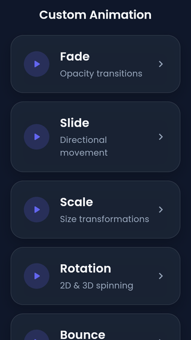](doc/assets/gifs/effects_demo.gif) | [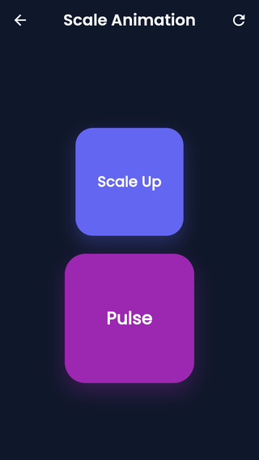](doc/assets/gifs/widgets_demo.gif) | [](doc/assets/gifs/transitions_demo.gif) | [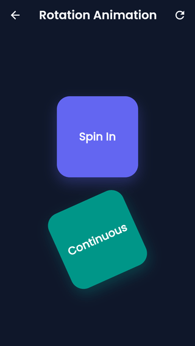](doc/assets/gifs/builders_demo.gif) |
| Fade · Slide · Scale · Rotation · Bounce · Shake · Pulse · Flip | AnimatedButton · AnimatedCard · AnimatedList · AnimatedDialog | FadeRoute · SlideRoute · SharedAxisRoute · HeroRoute | StaggerBuilder · SequenceBuilder · ChainBuilder · ParallelBuilder |

## Preview

### Core Effects

| Fade | Slide | Scale | Rotation |
|------|-------|-------|----------|
| 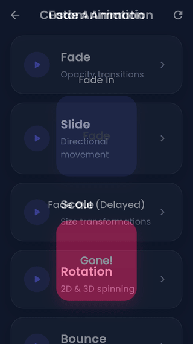 | 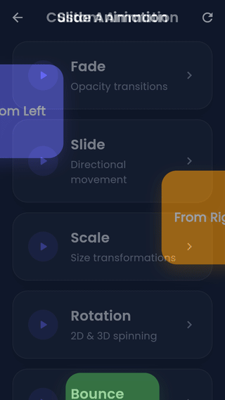 | 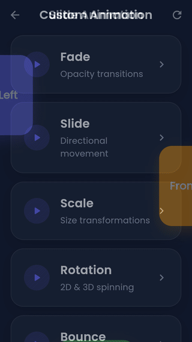 | 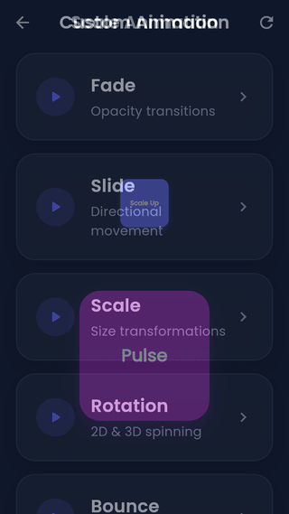 |

| Bounce | Shake | Pulse | Flip |
|--------|-------|-------|------|
| 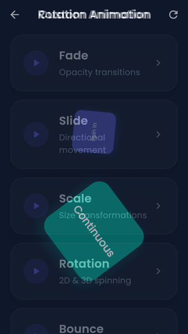 | 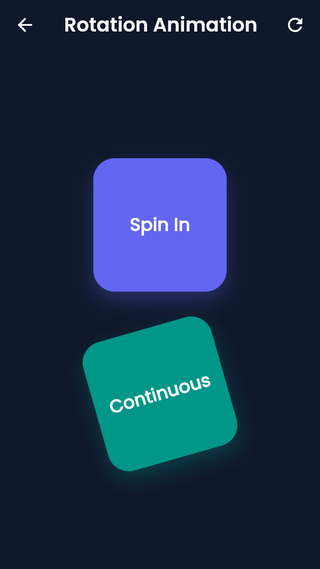 | 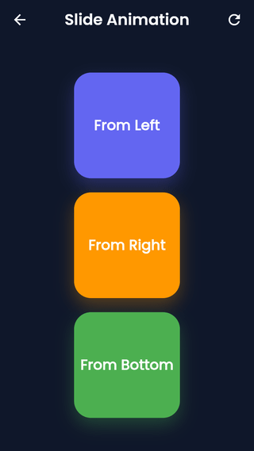 | 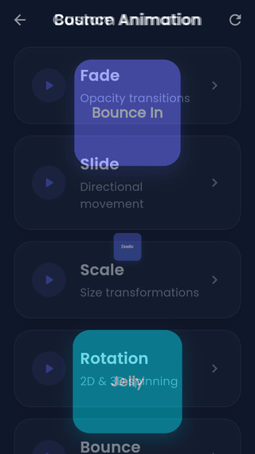 |

### Animated Widgets

| AnimatedButton | AnimatedCard | AnimatedList | AnimatedDialog |
|----------------|--------------|--------------|----------------|
| 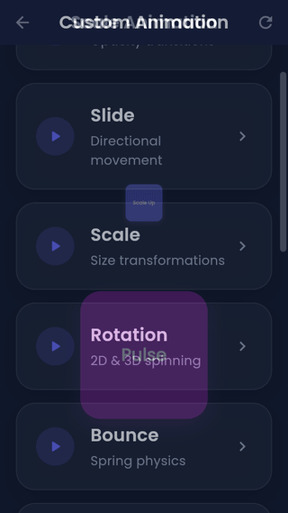 | 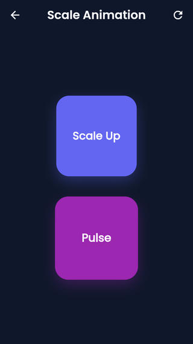 | 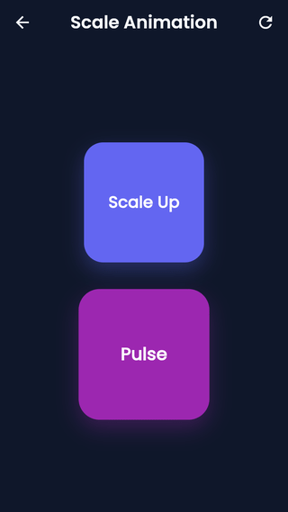 | 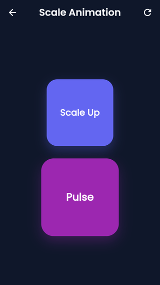 |

### Page Transitions

| FadeRoute | SlideRoute | SharedAxisRoute | HeroRoute |
|-----------|------------|-----------------|----------|
| 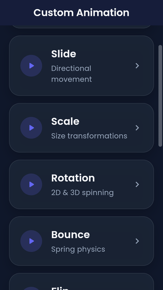 | 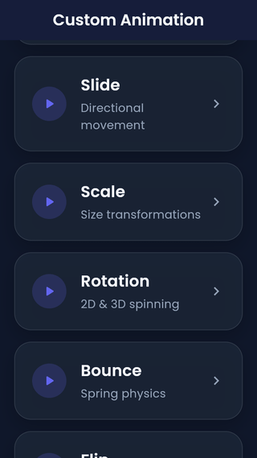 |  |  |

### Animation Builders

| StaggerBuilder | SequenceBuilder | ChainBuilder | ParallelBuilder |
|----------------|-----------------|--------------|------------------|
| 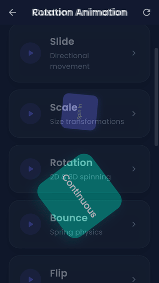 | 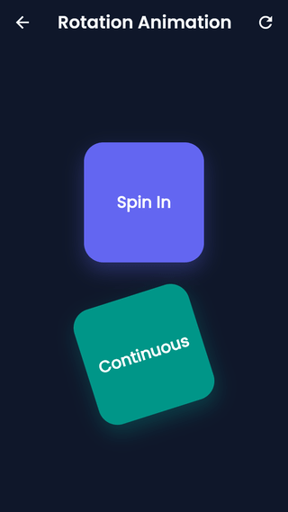 | 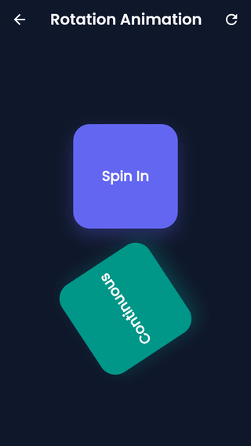 | 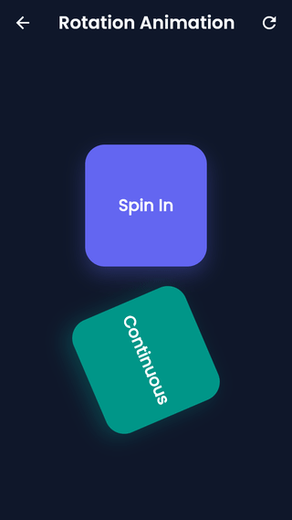 |

## Overview

`flutter_custom_animations` removes the boilerplate from Flutter animations. Instead of manually managing `AnimationController`s, `Tween`s, and `SingleTickerProviderStateMixin`s, you can add high-quality, performant animations to your apps using dead-simple widget extensions and pre-built animated widgets.

## Features

- **Animation Core:** Built on a highly optimized internal core handling controllers and lifecycles automatically.
- **Animation Effects:** Fade, Slide, Scale, Rotation, Bounce, Shake, Pulse, Flip, Blur, Zoom.
- **Animated Widgets:** Pre-built `AnimatedButton`, `AnimatedCard`, `AnimatedDialog`, `AnimatedContainer`, `AnimatedList`, `CustomAnimatedGrid`, and more.
- **Navigation Transitions:** Beautiful page transitions like `FadeRoute`, `SlideRoute`, `HeroRoute`, `SharedAxisRoute`, and more.
- **Animation Builders:** `SequenceBuilder`, `StaggerBuilder`, `ChainBuilder`, and `ParallelBuilder` to create incredibly complex chained animations with ease.
- **Widget Extensions:** Simply add `.animate()`, `.fadeIn()`, or `.slideIn()` to ANY Flutter widget to instantly animate it!

## Feature Comparison Matrix

| Component | Category | Zero Boilerplate | Auto Lifecycle | Chainable | Stagger / Sequence | Customizable |
|---|---|:---:|:---:|:---:|:---:|:---:|
| `FadeEffect` | Effect | ✅ | ✅ | ✅ | ✅ | ✅ |
| `ScaleEffect` | Effect | ✅ | ✅ | ✅ | ✅ | ✅ |
| `AnimatedButton` | Widget | ✅ | ✅ | — | — | ✅ |
| `CustomAnimatedList` | Layout Widget | ✅ | ✅ | — | ✅ | ✅ |
| `SharedAxisRoute` | Transition | ✅ | ✅ | — | — | ✅ |

## Architecture

The framework is cleanly modularized into:
1. `core`: Internal handlers and lifecycle management for `AnimationControllers`.
2. `effects`: Definitions for different animation types (Fade, Slide, Scale).
3. `widgets`: Smart widgets that automatically consume effects.
4. `transitions`: Ready-to-use page route transitions.
5. `builders`: Orchestrators for staggering and sequencing animations.
6. `extensions`: Syntactic sugar for rapid development without nesting.

## Installation

Add the following to your `pubspec.yaml`:

```yaml
dependencies:
  flutter_custom_animations: ^1.0.0
```

Then run:

```bash
flutter pub get
```

## Import

```dart
import 'package:flutter_custom_animations/flutter_custom_animations.dart';
```

## Quick Start

One import is all you need:

```dart
import 'package:flutter_custom_animations/flutter_custom_animations.dart';
```

### Widget Extensions — `.fadeIn()` & `.slideIn()`

The fastest path to animation: call extension methods directly on **any** widget. No controllers, no `StatefulWidget`.

```dart
// Fade in a Text widget
Text('Hello World').fadeIn(
  duration: const Duration(milliseconds: 600),
  curve: Curves.easeOut,
);

// Slide in from the bottom
Card(child: const Text('Card')).slideIn(
  begin: const Offset(0, 0.3),
  duration: const Duration(milliseconds: 500),
  curve: Curves.easeOutCubic,
);

// Chain multiple effects — they compose left-to-right
Container(width: 80, height: 80, color: Colors.deepPurple)
  .fadeIn(delay: const Duration(milliseconds: 100))
  .slideIn(begin: const Offset(-0.2, 0))
  .scaleIn(duration: const Duration(milliseconds: 400));
```

### AnimatedButton

A press-reactive button with a built-in scale-down feedback animation:

```dart
AnimatedButton(
  onPressed: () {
    // handle tap
  },
  pressedScale: 0.94,
  duration: const Duration(milliseconds: 120),
  curve: Curves.easeInOut,
  child: const Text('Tap Me'),
);
```

### CustomAnimatedList

Drop-in replacement for `ListView` that staggers entrance animations across all items automatically:

```dart
CustomAnimatedList(
  itemCount: items.length,
  itemBuilder: (context, index) {
    return ListTile(title: Text(items[index]));
  },
  duration: const Duration(milliseconds: 350),
  staggerDuration: const Duration(milliseconds: 60),
  effects: const [
    FadeEffect(),
    SlideEffect(begin: Offset(0, 40)),
  ],
);
```

### SharedAxisRoute

Replace `MaterialPageRoute` with a shared-axis transition in a single line:

```dart
Navigator.push(
  context,
  SharedAxisRoute(
    page: const DetailScreen(),
    transitionType: SharedAxisTransitionType.horizontal,
  ),
);
```

All route types — `FadeRoute`, `SlideRoute`, `ScaleRoute`, `ZoomRoute`, `HeroRoute`, `CupertinoRoute`, `MaterialMotionRoute` — share the same one-line API.

### StaggerBuilder

Orchestrate complex, multi-step entrance sequences with full timing control:

```dart
StaggerBuilder(
  totalDuration: const Duration(milliseconds: 900),
  children: [
    StaggerItem(
      startAt: 0.0,
      endAt: 0.4,
      child: const HeaderWidget(),
    ),
    StaggerItem(
      startAt: 0.25,
      endAt: 0.7,
      effects: const [FadeEffect(), ScaleEffect(begin: 0.8)],
      child: const BodyWidget(),
    ),
    StaggerItem(
      startAt: 0.55,
      endAt: 1.0,
      child: const FooterWidget(),
    ),
  ],
);
```

For linear pipelines use `SequenceBuilder`; for concurrent tracks use `ParallelBuilder`; for dynamic branching use `ChainBuilder`.

## API Overview

The `flutter_custom_animations` framework exports highly modular components:
- **Core Widgets:** `CustomAnimatedContainer`, `AnimatedText`, `AnimatedImage`, `AnimatedCard`, `AnimatedDialog`.
- **Form & Input:** `AnimatedButton`, `AnimatedTextField`, `AnimatedSearchBar`, `AnimatedFab`.
- **Layouts:** `CustomAnimatedList`, `CustomAnimatedGrid`, `AnimatedBottomNavigationBar`, `AnimatedDrawer`.
- **Transitions:** `FadeRoute`, `SlideRoute`, `ScaleRoute`, `ZoomRoute`, `SharedAxisRoute`, `HeroRoute`, `CupertinoRoute`, `MaterialMotionRoute`.

## Example Application

Check out the `example/` folder in the repository for a comprehensive showcase of every single feature, effect, and widget available in the framework.
Run it locally to see the animations in action!

### Static Component Breakdowns


## Folder Structure

```
lib/
├── src/
│   ├── builders/     # Complex animation sequencers
│   ├── core/         # State & lifecycle management
│   ├── effects/      # Atomic animation behaviors
│   ├── extensions/   # Syntactic sugar for standard widgets
│   ├── mixins/       # Reusable logic
│   ├── transitions/  # Page route definitions
│   ├── utils/        # Utilities
│   └── widgets/      # Pre-built animated components
└── flutter_custom_animations.dart
```

## Performance Best Practices

### Controller & Lifecycle
- **Never create `AnimationController`s manually** when using this library. The internal core manages attach, detach, and dispose automatically — creating your own leads to double-ticking and memory leaks.
- **Avoid calling `.animate()` inside `build()`** on every rebuild. Attach animations at the widget configuration level (e.g., inside `initState` or as a direct child of a `StatefulWidget`) so controllers are not recreated on every frame.

### Widget Tree Efficiency
- **Use `const` constructors** on all effect instances (`const FadeEffect()`, `const SlideEffect(...)`) so they are canonicalized and never trigger unnecessary re-renders.
- **Prefer Widget Extensions** (`.fadeIn()`, `.slideIn()`) over wrapping in effect containers for simple, one-off entrance animations — they produce a shallower widget tree.
- **Do not nest `StaggerBuilder` inside `ListView.builder`** without a `RepaintBoundary`. Add one around the stagger root to isolate its repaint region.

### Animation Duration Guidelines
| Interaction Type | Recommended Duration |
|---|---|
| Button press / micro-interaction | 80 – 150 ms |
| Card / list item entrance | 250 – 400 ms |
| Page transition | 300 – 450 ms |
| Hero / shared-element | 350 – 500 ms |
| Showcase / onboarding stagger | 600 – 1 000 ms total |

### Stagger & Builder Performance
- **Cap stagger item count at ~40** in a single `StaggerBuilder` or `CustomAnimatedList`. Beyond that, use lazy loading with `CustomAnimatedList`'s built-in virtualization support.
- **Use `ParallelBuilder` over nested `SequenceBuilder`s** when effects are independent — parallel execution is more GPU-friendly.
- **Set `curve: Curves.easeOutCubic`** (or `easeOutQuart`) as a default for entrance animations; it front-loads motion so the UI feels fast even at 400 ms durations.

### General
- **Run `flutter analyze`** before every commit — this library's lints will catch misused effects and unclosed controllers.
- **Profile on a real device** using `flutter run --profile`. The Flutter DevTools "Frames" tab will immediately surface jank caused by over-animated lists or excessive rebuilds.

## Contributing

Contributions are completely welcome! Please read our [CONTRIBUTING.md](CONTRIBUTING.md) and [CODE_OF_CONDUCT.md](CODE_OF_CONDUCT.md) for guidelines on how to get started.
Make sure to run `flutter analyze` and `flutter test` before submitting a pull request.

## License

This project is licensed under the MIT License - see the [LICENSE](LICENSE) file for details.

## Roadmap

- Add 3D card flipping widgets.
- Support for implicit layout animations.
- Integration with Rive animations.
